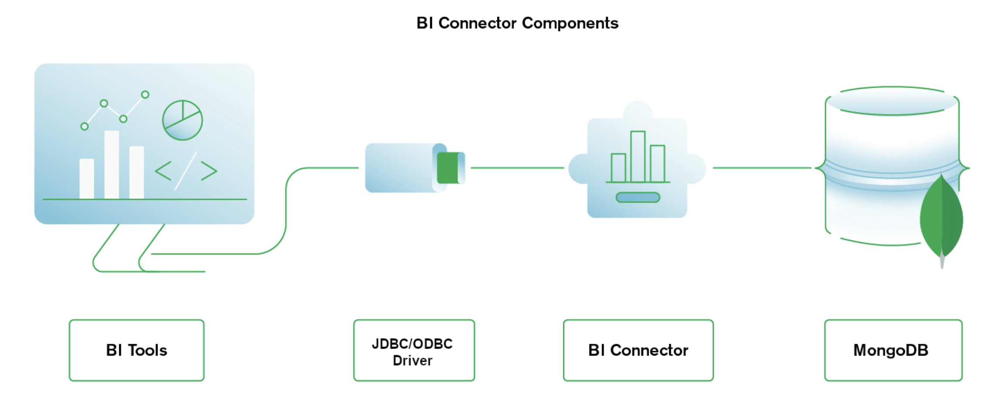

## Introduction

Business Intelligence (BI) tools like Tableau and Power BI are popular products for data visualization and analysis. They enable users to transform raw data into meaningful insights through interactive dashboards and reports. The [MongoDB BI Connector](https://www.mongodb.com/docs/bi-connector/current/) allows you to create queries with SQL to visualize, graph, and report on your three-dimensional MongoDB data using relational business intelligence tools.

The MongoDB BI Connector acts as a bridge between MongoDB and BI tools, allowing you to visualize and analyze your MongoDB data without complex data transformations. This guide will cover the installation of the BI Connector, configuration, and connection of your BI tool to OVHcloud cluster.



## Quick Start Guide

Refer to the MongoDB documentation for a [Quick Start Guide](https://www.mongodb.com/docs/bi-connector/current/local-quickstart/#quick-start-guide-for-windows).

## Connect the BI tool to the OVHcloud cluster

### STEP 1: Install the BI Connector

Refer to the MongoDB documentation for [installing the BI connector](https://www.mongodb.com/docs/bi-connector/current/installation/#install-bi-connector-on-premises).

### STEP 2: Launch the BI Connector

Refer to the MongoDB documentation for [launching the BI Connector](https://www.mongodb.com/docs/bi-connector/current/launch/#launch-bi-connector)

below is an example for starting the connector with the OVHcloud cluster:

```javascript
mongosqld --mongo-uri "mongodb://node2-0b70a1b78fff6c0e.database.cloud.ovh.net:27017,node1-0b70a1b78fff6c0e.database.cloud.ovh.net:27017,node3-0b70a1b78fff6c0e.database.cloud.ovh.net:27017/" --auth -u mongoadmin -p erm0JRULGak56OKW1Yf4v --mongo-ssl
```

Refer to MongoDB documentation for addtional information on [starting the mongosqld](https://www.mongodb.com/docs/bi-connector/current/reference/mongosqld/). 

### STEP 3: Connect BI Tools

Refer to the MongoDB documentation for [connecting the BI tool](https://www.mongodb.com/docs/bi-connector/current/client-applications/).

## We want your feedback!

We would love to help answer questions and appreciate any feedback you may have.

If you need training or technical assistance to implement our solutions, contact your sales representative or click on [this link](https://www.ovhcloud.com/en-gb/professional-services/) to get a quote and ask our Professional Services experts for a custom analysis of your project. Join our community of users on <https://community.ovh.com/en/>.

Are you on Discord? Connect to our channel at <https://discord.gg/ovhcloud> and interact directly with the team that builds our databases service!
